# Abstract
As the number of Large Language Models increase steadily, and the number of fine-tuned variants grows rapidly, storage space for model weights becomes critical. Lossy methods of compression, such as quantization, reduce model storage footprint at the cost of accuracy. Here we show that orthogonal to quantization is lossless compression. In particular, generating realistic synthetic model weights, we analyze the efficacy of various strategies for lossless model weight compression, demonstrating effectiveness across quantization methods. We conclude that different design paradigms exist for compressing models and for compressing their fine-tuned variants, offering insight into directions of inquiry for future LLM lossless compression algorithms. 


# 1 Background and Introduction

State-of-the-art Large Language Models can have hundreds of billions to a trillion parameters. Often trained and stored in their original FP32 or FP16/BF16 precisions, this can translate to terabytes of storage for model weights alone. While this is not an overwhelming size, with every checkpoint and fine-tuned model resulting in a new set of weights with an equivalent storage footprint, this can quickly become overwhelming, particularly for large model repositories such as Huggingface, which must keep millions of models readily accessible for users [1]. At the same time, the desire to integrate high quality models with a large number of parameters into edge devices or personal devices with significantly less storage capacity similarly becomes an issue. 

Traditional approaches to model size reduction have examined lossy methods of compression. One primary method is quantization, where model weights can be reduced to 8-bit or even 4-bit formats at the cost of model coherence at inference time. For instance, NVIDIA’s NVFP4 format reduces each model weight to 4 bits, alongside block-level scaling factors, and has been shown to have comparable performance to FP8 counterparts [2]. The main design choice in quantization schemas is selecting the number of exponential and mantissa bits, which control range of values expressible and precision of values respectively. Even at higher precisions, this distinction is important: BF16, for instance preserves the same number of exponential bits as FP32, while FP16 has fewer exponential bits than BF16, and instead has more mantissa bits [3]. 

Unfortunately, for large model repositories such as Huggingface, weights are almost always stored in the highest precision format, and users given the option to quantize the model on their own. As a result, Huggingface and similar services cannot benefit from the storage capacity savings enabled by quantization. As such lossless model weight compression may prove to be of great importance as the number of models, and their sizes, increases with the passage of time. At first glance, one might expect model weight compression is difficult, as one would expect model weights to be close to random. However, it has been found that while the distribution of sign and mantissa bits for model weights tends to be random, such is not the case for the exponential bits, nor is it the case for the block-wide scaling factors present in NVFP4 and MXFP4 formats [4]. In fact estimates show that for a format with 8 exponential bits, model weights typically store only 2.6 to 3 bits of information, indicating high potential for compressibility, whereas for the 8 mantissa bits tend to store 8 bits of information, generally resulting low compressibility [5,6].

Modern lossless LLM weight compression algorithms hence exploit the high compressibility of the exponential bits, combining this preprocessing with standard lossless compression algorithms such as zstd and zlib [7]. The ZipNN algorithm, for instance, utilizes this method to compress LLM models to under 50\% the original size, over 17\% better than vanilla compression algorithms [7]. Other LLM weight compression algorithms, such as ZipLLM, target fine-tuned models, observing that the weights of fine-tuned models exhibit high similarity to the underlying pre-tuned model. By computing the XOR between the baseline and fine-tuned model, a very sparse set of weight deltas that are highly admissible to compression is generated [8]. With over 99.6\% of models being fine-tuned models, the ability to strongly compress these fine-tuned variants is of significant value.

# 2 Simulation Methodology

In this paper, we hope to analyze the capacity of different compression algorithms to reduce the storage footprint of LLM models, providing insight into strategies for optimal LLM weight compression. In addition to examining different algorithms, we examine how different weight formats and quantization formats may affect the performance of compression algorithms.

## 2.1 Synthetic Data Generation
To provide the data on which the compression algorithms would be applied, we generate synthetic model weights. The primary reason is the limited compute and time available. To directly perform multiple full scale evaluations on LLM models with tens of billions of parameters is highly computationally taxing. In addition, to ensure results are not due to spurious abnormalities for a particular model or family of models, it would be necessary to evaluate across a substantial number of LLM models. This is unfortunately intractable for the scope of this study. On the other hand, synthetic data based on universally observed statistics and trends will result in reasonable approximations with a sliver of the compute cost. In addition, certain statistical properties of the synthetic data, such as independence, enable results to be scaled essentially arbitrarily: while using a 1B parameter fraction of an 8B parameter model may fail to capture characteristic weight traits, a 1B parameter synthetic generation can share sufficient similarities to an 8B parameter synthetic generation, such that results on 1B parameter synthetic data will apply to larger synthetic models as well. A more important reason to use synthetic data is that it allows for controlled ablations on model weight traits: one can increase or decrease weight variance for instance, and observe its impact on compressibility, whereas it would be difficult to find a set of real-world models for which it is possible to control all but one factor in the model weights.

### 2.1.1 Model Weight Assumptions

The most powerful observation across LLM model weights is the phenomenon that model weights tend to be normally distributed with a mean of 0 in a majority of cases [9]. This enables us to simulate model weights as draws from a Gaussian distribution with an appropriate variance. While limited literature exists with respects to the variance of LLMs with billions of parameters, smaller studies suggest ranges between 0.01 and 0.1 [10]. Hence, we ablate the model weight variance between 0.01 and 0.5, to test a large range of variances. 

One additional finding that weighs heavily on assumptions needed for the generation of model weights is the presence of outlier weights. In particular, it is observed that models larger than 6.7B parameters tend to possess around 0.1\% of weights with magnitudes over 20 times the magnitude of average model weights [11]. Hence, to generate synthetic data representative of larger LLM models, we randomly select a 0.1\% subset of weights to be drawn from a distribution with standard deviation increased by a factor of 20. Hence, our model weights are independent identically distributed draws from the following distribution:

$$W_i \sim \mathcal{N}(0, \sigma^2 + 399\sigma^2O_i)$$
$$\text{ for } O_i \sim \text{Bern}(0.001)$$
$$\text{ where } \sigma^2 \in [0.01, 0.025, 0.05, 0.1, 0.25, 0.5]$$
For each variance, we generate $2^{30}$ individual weights, corresponding to a roughly 1B parameter model. In addition, we wish to generate synthetic representations of fine-tuned models for evaluating strategies for XOR delta compression pre-processing. To do so, we observe that fine-tuning typically changes only a small fraction of weights, particularly efficient fine-tuning methods such as LORA. Indeed, for LORA fine-tuning, even at higher rank injections, less than 0.01\% of weights will be changed [12]. Hence, to approximate light fine-tuning on models, we re-sample 1\% of weights, a factor 100 increase from LORA fine-tuning. In particular, we take our original $W_i$ distribution as a prior, updating to a posterior distribution based on the realized $w_i$ from which to sample to fine-tuned weight value. Note that as the re-sample is random, the synthetic fine-tuned data will be exhibit substantially higher entropy than a real-world fine-tuned model, where in affected weights tend to be the outliers and a localized section of weights. Nonetheless, the results from synthetic data will provide a solid upper-bound estimate on compressibility of lightly fine-tuned models. Hence our fine-tuned model is given by:

$$F_i \sim (1 - R) \cdot w_i + R \cdot \mathcal{N}(\frac{w_i}{2}, \frac{\sigma^2 + 399\sigma^2O_i}{2})$$
$$\text{ for } R \sim \text{Bern}(0.01)$$

### 2.1.2 Quantization formations

Once we have generated the full precision model weights, we should like to turn them into quantized formats, to examine how quantization format specific differences may result in difference in compressibility. We examine full precision FP32, BF16, BF32, two variants of FP8 (E4M3 and E5M2, whcih represent the number of exponential and mantissa bits), MXFP4, and NVFP4. The 4-bit quantization formats also possess block-level scaling factors, which we also replicate. We give MXFP4 an E8M0 scaling factor per 32-value block, NVFP4 an E4M3 scaling factor per 16-value block, and the FP8 formats each an E8M32 (standard FP32) scaling factor per 128-value block [13, 14]. 

We note that we quantize in a computationally efficient but crude manner. For instance, we do not employ stochastic rounding, which is common practice in quantization [14]. Luckily, stochastic rounding only greatly influences the last mantissa bit, and hence is unlikely to have substantial impacts on compression evaluations. Nor do we utilize the Random Hadamard Transforms implemented in NVFP4, which reduce the probability of multiple outliers in each block [14]. Random Hadamard Transforms help to diminish truncation of outliers by clustering wieghts more closely by magnitude. This in turn means less variance in magnitude between adjacent values which may in fact improve compressibility. Hence, in this case, our synthetic data is either equal to or marginally less favorable than actual model weights, ensuring it is close to an accurate representation.

## 2.2 Compression Algorithms

We select two underlying 6 pre-processing strategies and 2 underlying compression algorithms upon which to test the synthetic data. The underlying compression algorithms selected are Huffman encoding, and Zstd, which leverages LZ77 pattern-matching on top of Huffman encoding [15]. For the pre-processing, we test variants where we split the weights by different metric and compress the split portions separately. In particular, we split weights by bytes, by bit, and by semantic groups, that is into three groups: the sign bit, exponential bit, and mantissa bits. For quantization methods with scaling factors, we use the same splits for the scaling factors. In addition, we also test Meta's Gorilla compression pre-processing strategy which involves XORing consecutive elements, which would be weights in this instance [16]. We also test two pre-processing methods for fine-tuned weights. First we test weight-pair XORing, as proposed in ZipLLM. Second, we combine weight-pair XORing with Gorilla's comsecutive weight XORing. We also run Huffman and Zstd without any preprocessing to serve as a baseline.

Due to compute and memory limitations, we partition weights into 128 MiB chunks, and execute the pre-processing and compression across individual chunks. We report cumulative runtime and compression results across all chunks. We execute one single-threaded process per pair of algorithms and synthetic weights. All source code and results can be found at https://github.com/ericgong2005/LosslessModelCompression

# 3 Results and Discussions

## 3.1 Model Weight Compressibility with Respect to Weight Distribution Variance

```{r, echo=FALSE, fig.cap="Mean and standard deviation of compression ratios across weight distribution variance ablations for each Algorithm-Quantization pair.", fig.show='hold', out.width="45%", fig.align="center"}
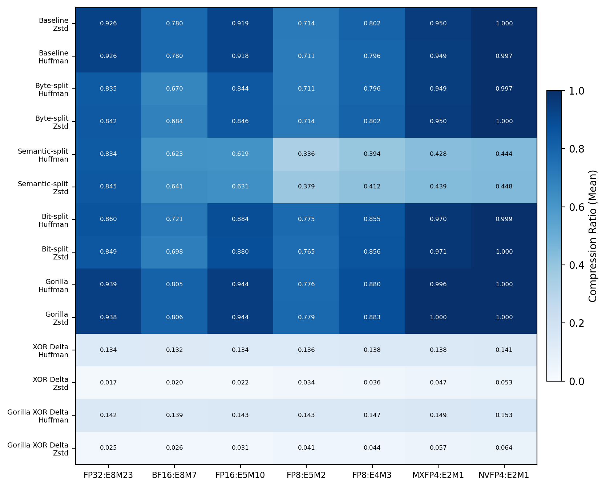
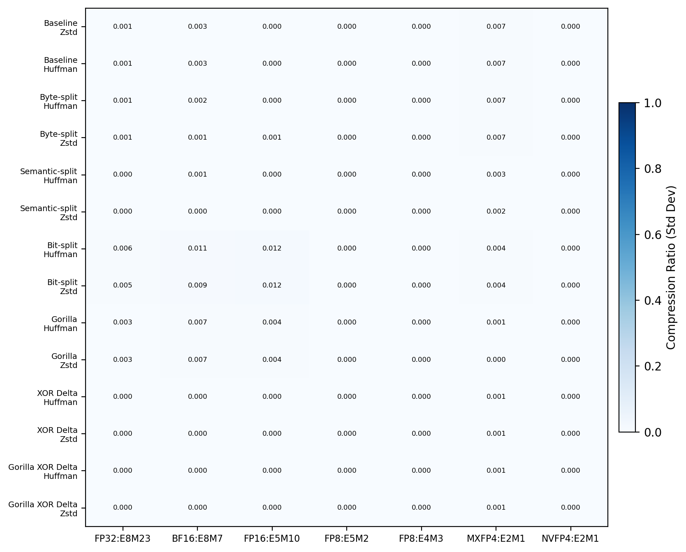
```

```{r, echo=FALSE, fig.cap="Mean and standard deviation of compression througput across weight distribution variance ablations for each Algorithm-Quantization pair.", fig.show='hold', out.width="45%", fig.align="center"}
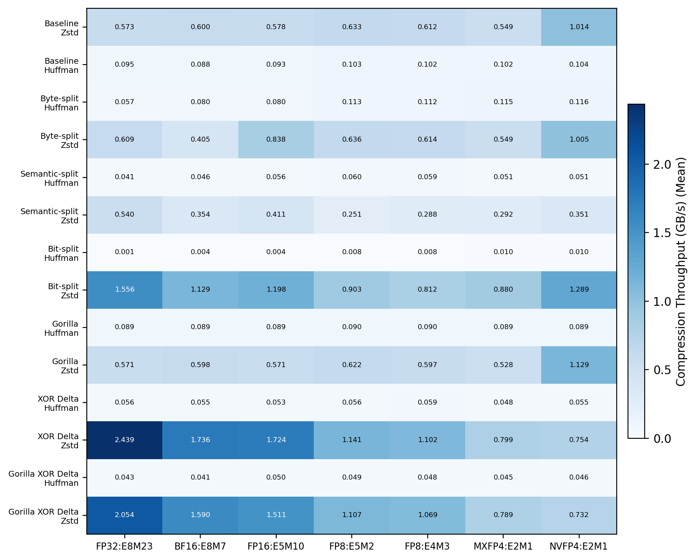
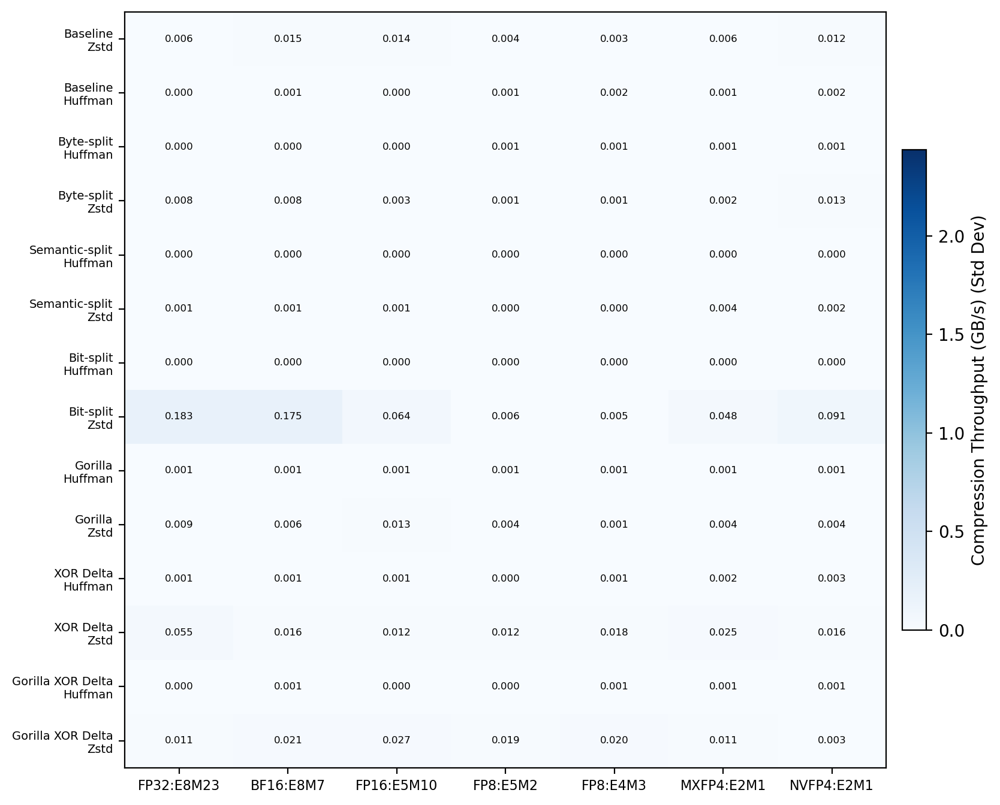
```

We find that the difference in the compression ratio and compression throughput does not significantly change when ablating the initial variance used to generate the model weights. This can be seen in Figure 1 and Figure 2 respectively, where the standard deviation across diferent weight variance ablations is minute in comparison to the average value. As such, for all future evaluations, we treat the differing ablations of variance as different trials for each Algorithm-Quantization pair, enabling us to estimate variance in our measurements across trials.

## 3.2 Model Weight Compressibility Across Algorithms

### 3.2.1 Compression Ratio

```{r, echo=FALSE, fig.cap="", out.width="80%", fig.align="center"}
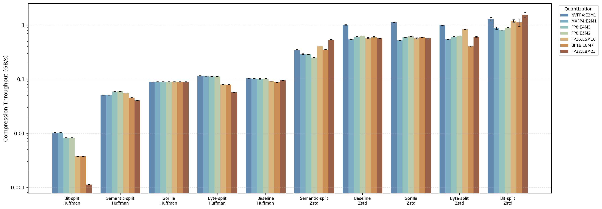
```

Figure 3 analyzes synthetic model weight compressibility across different algorithms and quantizations. We find that in all cases, the pre-processing step has a far more substantial impact on final compressibility than the underlying compression algorithm. In particular, the gorilla pre-processing method exhibits worse performance than the baseline, while any sort of splitting pre-processing outperforms the baseline. We find interestingly that while higher quantizations levels such as FP32 have equally poor compressibility across split-type compression methods (semantic, bit, or byte) at over 80\% compression ratio, smaller quantizations levels see significantly increased performance with the semantic split pre-processing method.

```{r, echo=FALSE, fig.cap="Sematic group compressibility measured in the Semantic-splitting (Huffman) method across quantizations.", out.width="70%", fig.align="center"}
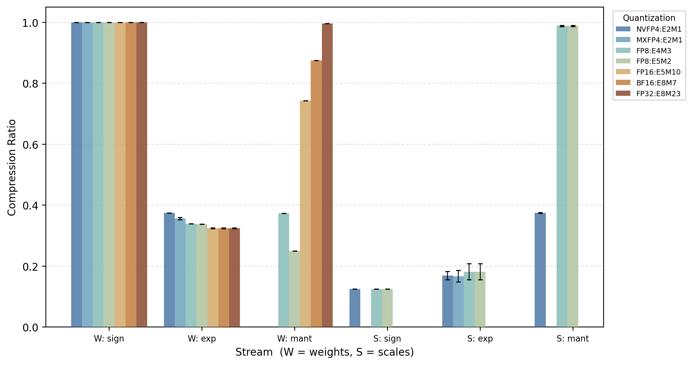
```

```{r, echo=FALSE, fig.cap="Bit-level compressibility measured in the Bit-splitting (Huffman) method for BF16 quantization", out.width="70%", fig.align="center"}
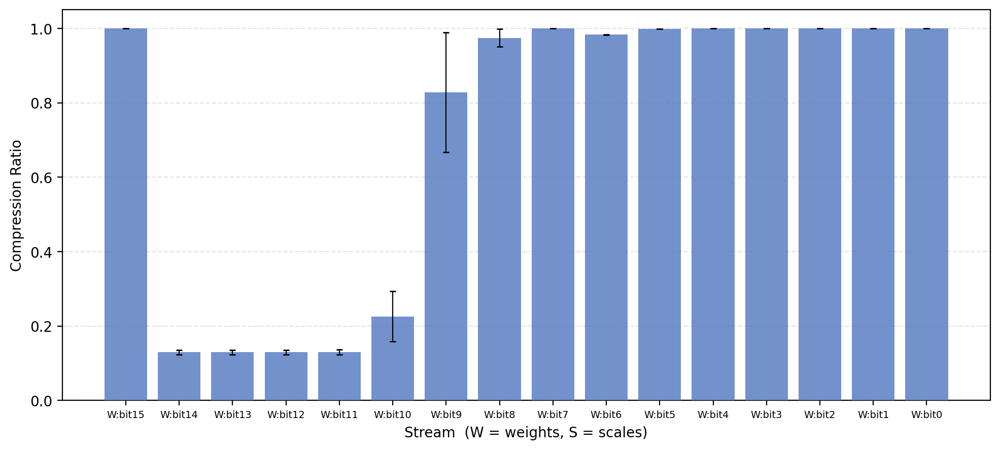
```

The reason for which this difference arises can be determined based by examining the split-level compressions. As a reminder, bit-splitting is a more fine-grained splitting method than semantic splitting, and byte-splitting is a more coarse method for splitting than semantic-splitting. In particular, it can be seen in Figures 4 and 5 that the sign bit of the weight always exhibits close to no compressibility and the exponential bits exhibit high compressibility. In addition, the mantissa bits, when each treated on their own exhibit essentially no compressibility. However, for smaller quantization levels, the mantissa bits as a group appear to exhibit some level of compressibility. This second observations explains why semantic splitting outperforms bit-splitting: the difference is in the compressibility of the mantissa bits. The first observation explains why the byte-splitting preprocessing is worse than both: byte-level splitting mixes exponential bits with the sign bit, greatly decreasing total compressibility in comarison to keeping the sign bit separate. Finally, the first observation is critical for explaining why smaller quantizations outperform larger ones: when the quantization size is smaller, the proportion of exponential bits to mantissa bits is higher: a greater proportion of the weight is compressible. Hence, smaller quantizations are more compressible. The same trend can be seen in quantization methods of the same size, but with a different exponential bit to mantissa bit ratio. For instance, we see in Figure 3 that BF16 is more compressible than FP16 across the board, as the former has 8 exponential bits while the latter only has 5. Similarily FP8 (E5M2) outperforms FP8 (E4M3) due to having more exponential bits as well.

```{r, echo=FALSE, fig.cap="Bit-level compressibility measured in the Bit-splitting (Huffman) method for FP8 (E4M3) quantization", out.width="90%", fig.align="center"}
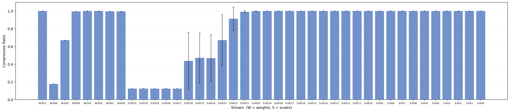
```

```{r, echo=FALSE, fig.cap="Bit-level compressibility measured in the Bit-splitting (Huffman) method for FP8 (E5M2) quantization", out.width="90%", fig.align="center"}
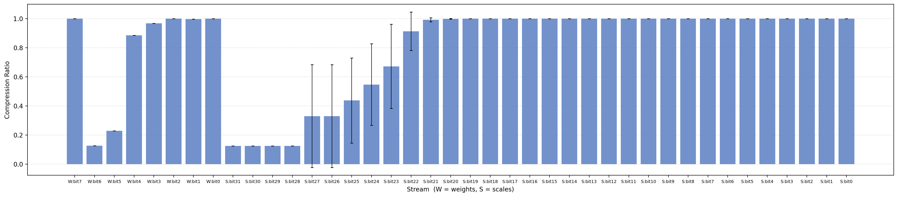
```

The bit-splitting pre-processing method also yields an interesting observation confirming results on the bits of information carried by the exponential bits. Interestingly we find that in Figure 4, of the exponential bits (labeled W:bit14 through W:bit7), the first five exhibit high compressibility and the latter three exhibit low to no compressibility. Similarly in Figure 6, of the exponential bits in FP8 (E4M3) (labeled W:bit6 through W:bit3) the first bit is highly compressible while the remaining three are not. Finally in Figure 7, of the exponential bits in FP8 (E5M2) (labeled W:bit6 through W:bit2) the first two bits are highly compressible while the remaining three are not. This aligns closely with previous research that demonstrations exponential bits tend to carry 2.6 to 3 bits of information. We show that a proxy of this trend appear to hold across quantization levels. We note that MXFP4 and and NVFP4, although defined as E2M1, in practice follow a 3-bit mapping as opposed to a true E2M1 structure, and is hence excluded from comparison here.

One final note is the fact that the sign bit of the scaling factor appears to exhibit high compressibility. This can be seen when examining the scaling factor sign bit in Figures 6 and 7 (S:bit31) as well as in the scaling factor sign bit in Figure 5. This trend holds across quantizations for which a scaling factor exists, and the scaling factor possesses a sign bit (a reminder that the scaling factor for MXFP4 is E8, and hence has no sign bit). The reason for this is that the scaling factor is multiplicative, and hence always constant. In all scaling factors except that for MXFP4, the sign bit is wasted. Hence, we could acheive marginally higher compressibility in our our pre-processing step by simply discarding the sign bit, which currently has a compression ratio of 10\%. Of course, given that you would only see a reduction equivalent to 10\% of one bit of each scaling factor, which is a fairly trivial amount. For instance, for FP8 scaling factors, the saving is on average one tenth of a bit per 128 weights, which, for a 1B parameter model works out to just over 0.1 MB of saving; the majority of compression improvements will come from more sophisticated pre-processing and underlying algorithm improvements beyond Huffman and Zstd.

### 3.2.2 Compression Throughput

```{r, echo=FALSE, fig.cap="", out.width="90%", fig.align="center"}

```

We find that unsurprisingly, the main influence on compression throughput is the underlying algorithm: Figure 8 illustrates that Zstd appears to have higher compression throughput accross the board than Huffman encoding. We find that for our most optimal pre-processing by compression ratio, semantic splitting, when combined with Zstd has a throughput of around 0.5 GB/s across all quantization types on a single thread. In general, the throughput does not depend heavily on the quantization type, except for bit splitting on Huffman, where there is nearly a 10x throughput difference between the fastest and slowest quantizations. The differences between Huffman and Zstd with respects to compression speed, and observations on differences between different quantizations may best be left to papers directly exploring the mathematical nature of compression algorithms, and is hence declared to be beyond the scope of this paper.

## 3.3 Fine-tuned Model Weight Compressibility Across Algorithms

### 3.3.1 Compression Ratio

```{r, echo=FALSE, fig.cap="", out.width="90%", fig.align="center"}
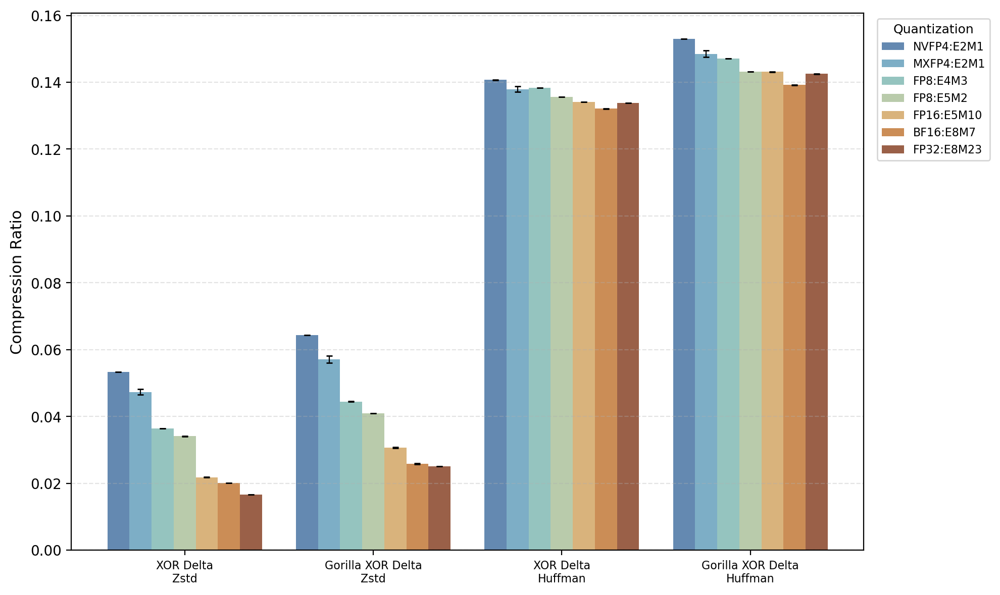
```

We see in Figure 9 that for Fine-tuned models where we use weight-pair XOR and weight-pair XOR with Gorilla, that using Gorilla is generally worse for compression ratio than without, although marginally so. This is similar to the trend observed in Figure 3. Evidently the use of an ill-fitted compression pre-processing step is worse than no pre-processing at all. However, differing from Figure 3, we find that the underlying compressiong algorithm has a far greater effect on the compression ratio. In particular, Zstd exhibits significantly better compression ratios than Huffman-based algorithms. Observing that a majority of weights remain unchanged, the weight-pair XOR between the base and fine-tuned model would result in a highly sparse delta. Hence, an algorithm more capable of compressing sparse data would likely benefit.

### 3.3.2 Compression Throughput

```{r, echo=FALSE, fig.cap="", out.width="90%", fig.align="center"}
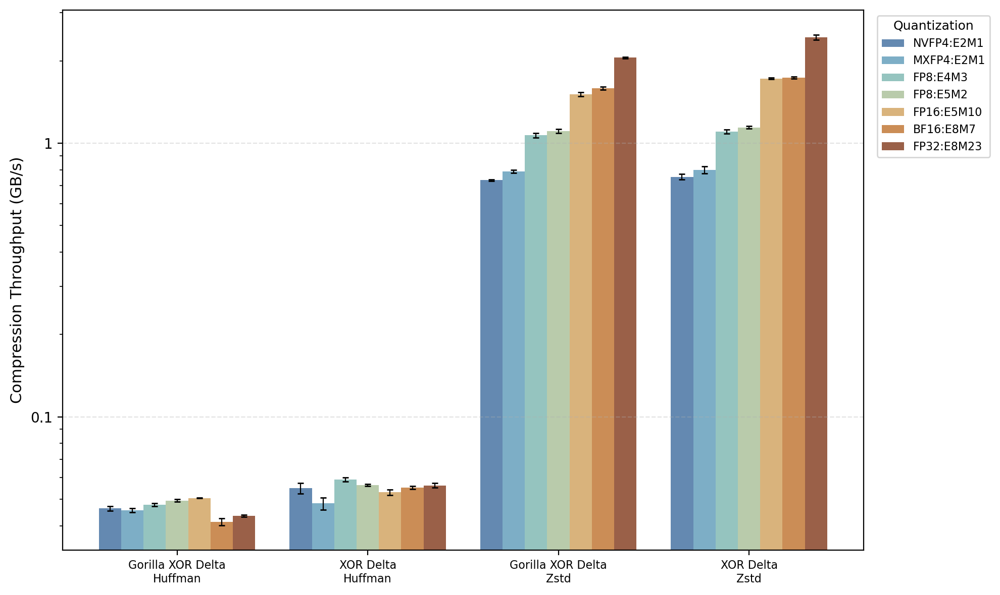
```

We see in Figure 10 that similar to the results for the compression throughput of normal synthetic model weights, the compression throughput of the weight-pair XORs is substantially higher for Zstd than Huffman encoding. In addition, compared to compressing normal synthetic model weights, the compression for the weight-pair XORs has a two-fold increase in througput, at around 1GB/s on a single thread. This is interestingly lower than what might be expected, given that the synthetic data is such that around 99% of the weight-pair XORs is zero. Hence, again we conclude that developments in the underlying compression algorithm will greatly improve performance for fine-tuned model deltas, particularly for throughput, a compression algorithm that shows strong speed-ups when data is highly sparse.

# 4 Conclusion

Through the experimentation conducted during the progression of this paper, we find derive various insights which may be of use to the storage of LLM model weights. We find that compression is worth the effort, particularly lower precision models. Scaling the results of this paper, we would predict that even state of the art models with hundreds of billions of parameters can be compressed in the order of minutes, and can yield 40\% reductions in storage necessary for 16 bit models, and around 60\% reductions in storage necessary. For lightly fine-tuned models, compression is even more promising: we show that the equivalent of a LORA fine-tuned model can be compressed to yield nearly 95\% reductions in space, again at compression times in the order of minutes. This paper also reinforces specific quantization format trends, such as how exponential bits indeed are the most compressible, which indicates that when training models to be stored under storage constraints, using weight formats with more exponential bits alongside compression is beneficial. Of course, more exponential bits also has the added benefit of increasing dynamic representation range, enabling outliers and extreme weights to be properly represented, which itself may be seen as a benefit. The paper also identifies that there exist different paradigms for different compression use-cases: when compressing full models, and attempting to design better compression algorithms for full models, identifying proper pre-processing strategies is critical. On the other hand, for compressing fine-tuned models as a delta from the initial model, it would be more important to consider underlying algorithms that can leverage high sparcity to increase compressibility and throughput. 

Of course, this paper is not without drawbacks. While there are many benefits to utilizing synthetic data, there is no replacement to large-scale analysis on real model weights. To apply this workflow with across real model weights would allow for significantly stronger support of results. Second, the re-sampling ratio for fine-tuned model weights, although useful for offering insight into lightly fine-tuned models, such as those fine-tuned with LORA, does not offer significant insight into more involved fine-tuning. For instance, RLHF changes between 5\% and 30\% of model weights [17]. To repeat the current workflow with a higher re-sampling rate would enable insights to be derived on the extent to which weight-pair XOR compression would be useful for storing incremental training checkpoints, or more broadly, all fine-tuned models beyond those that are lightly trained.

Overall, this paper represents an in-depth analysis of LLM weight compression algorithms under a highly controlled set of assumptions, imposed through the synthetic data utilized in experimentation.

# 5 Acknowledgments

Under the guidance and direction of Professor Juncheng Yang, Eric Gong developed the framework and methodologies for experimentation. Eric Gong selected the parameters for generating the synthetic data, the different pre-processing strategies, and the different quantization types. Claude Sonnet 4.6 wrote all code to carry out all synthetic data generation, compression benchmarking, and plot generation under the supervision of Eric Gong, who only contributed minimal bug-correction and stylistic interventions to the code. Eric Gong wrote the entirety of the paper with the sole exception of the Sources section and RMarkDown header, for which Claude Sonnet 4.6 was used to turn accessed article links into citations and generate the proper formatting conventions for RMarkDown respectively. 

# 6 Sources

[1] Hugging Face. (n.d.). Hugging Face Hub documentation. https://huggingface.co/docs/hub/index

[2] NVIDIA, Abecassis, F. et. al. (2025). Pretraining large language models with NVFP4. arXiv. https://doi.org/10.48550/arXiv.2509.25149

[3] Henry, G., Tang, P. T. P., & Heinecke, A. (2019). Leveraging the bfloat16 artificial intelligence datatype for higher-precision computations. arXiv. https://arxiv.org/abs/1904.06376

[4] Jain, S., Kumar, A., & Singh, S. (2025). Lossless compression of neural network components: Weights, checkpoints, and optimizer states. arXiv. https://arxiv.org/abs/2508.19263

[5] Hao, Y., Cao, Y., & Mou, L. (2024). NeuZip: Memory-efficient training and inference with dynamic compression of neural networks. arXiv. https://doi.org/10.48550/arXiv.2410.20650

[6] Nikulin, I. (2026). Unweight: Lossless MLP weight compression for LLM inference (Cloudflare Technical Report Cf-TR-2026.04.v1). Cloudflare, Inc. https://research.cloudflare.com/papers/unweight-2026.pdf

[7] Hershcovitch, M., Wood, A., Choshen, L., Girmonsky, G., Leibovitz, R., Ennmouri, I., Malka, M., Chin, P., Sundararaman, S., & Harnik, D. (2024). ZipNN: Lossless compression for AI models. arXiv. https://doi.org/10.48550/arXiv.2411.05239

[8] Wang, Z., Lan, T., Su, Z., Yang, J., & Cheng, Y. (2025). ZipLLM: Efficient LLM storage via model-aware synergistic data deduplication and compression. arXiv. https://doi.org/10.48550/arXiv.2505.06252

[9] Dettmers, T., Pagnoni, A., Holtzman, A., & Zettlemoyer, L. (2023). QLoRA: Efficient finetuning of quantized LLMs. arXiv. https://doi.org/10.48550/arXiv.2305.14314

[10] Han, Y. (2025). Weight initialization and variance dynamics in deep neural networks and large language models. arXiv. https://doi.org/10.48550/arXiv.2510.09423

[11] Dettmers, T., Lewis, M., Belkada, Y., & Zettlemoyer, L. (2022). GPT3.int8(): 8-bit matrix multiplication for transformers at scale. In S. Koyejo, S. Mohamed, A. Agarwal, D. Belgrave, K. Cho, & A. Oh (Eds.), Advances in Neural Information Processing Systems (Vol. 35). NeurIPS.

[12] Hu, E. J., Shen, Y., Wallis, P., Allen-Zhu, Z., Li, Y., Wang, S., Wang, L., & Chen, W. (2021). LoRA: Low-rank adaptation of large language models. arXiv. https://arxiv.org/abs/2106.09685

[13] Lin, H., Jia, X., Xu, H., Yao, B., Guo, X., Wu, Y., Lu, Z., Wei, Y., Zhang, Q., & Sun, Z. (2026). DuQuant++: Fine-grained rotation enhances microscaling FP4 quantization (arXiv:2604.17789). https://doi.org/10.48550/arXiv.2604.17789

[14] Micikevicius, P., et al. (2025). Pretraining large language models with NVFP4 (arXiv:2509.25149). https://doi.org/10.48550/arXiv.2509.25149

[15] Collet, Y., & Kucherawy, M. (2021). Zstandard compression and the application/zstd media type (RFC 8878). Internet Engineering Task Force. https://doi.org/10.17487/RFC8878

[16] Pelkonen, T., Cavallaro, P., Huang, Q., Franklin, S., Meza, J., Teller, J., & Veeraraghavan, K. (2015).
Gorilla: A fast, scalable, in-memory time series database. Proceedings of the VLDB Endowment, 8(12), 1816–1827. https://doi.org/10.14778/2824032.2824078

[17] Balashov, A. (2025). Reinforcement learning fine-tunes a sparse subnetwork in large language models. arXiv. https://arxiv.org/abs/2507.17107
